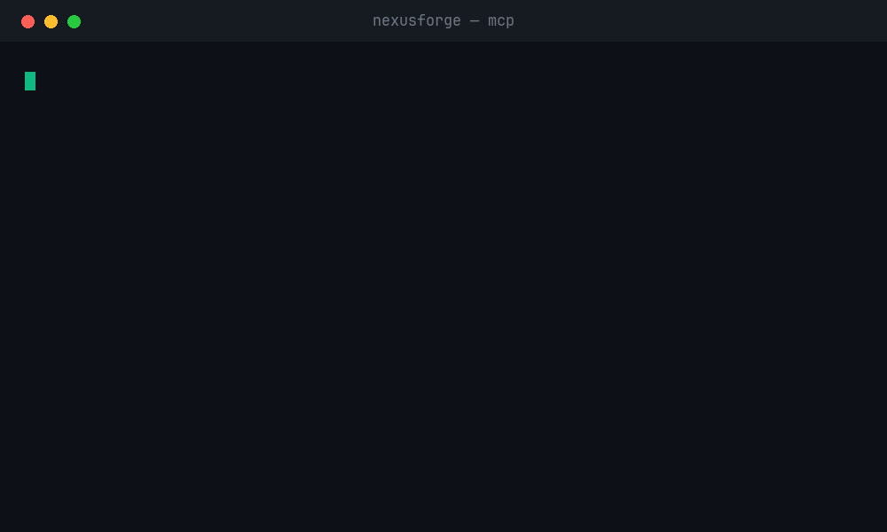

<div align="center">

# ⚡ NexusForge

### Code · Scan · Heal · Extend · Test · Deploy · Guard

The world's first open-source AI development platform covering the **complete software lifecycle** — from coding to deployment to monitoring — and now plugged straight into your AI editor over **MCP**. **8 packages**, fully typed, with a passing test suite — all free, private, and multi-model.

[](https://opensource.org/licenses/MIT)
[](#roadmap)
[](https://github.com/0xgetz/nexusforge/pulls)
[](#-quick-start)
[](#-nexusforgemcp--mcp-server)

[Website](https://nexusforge.dev) · [Documentation](#packages) · [Roadmap](#-roadmap) · [Contributing](#-contributing)

</div>

---

## 🔥 The Problem

Open-source security in 2026 has reached a critical tipping point:

| Metric | 2024 | 2025 | Change |
|--------|------|------|--------|
| Avg. vulnerabilities per codebase | 280 | 581 | **+107%** |
| Unique vulnerabilities per codebase | 147 | 237 | **+61%** |
| Codebases with high-risk vulns | 44% | 65% | **+21pp** |
| Codebases with OSS components | 96% | 98% | **+2pp** |

> Source: OSSRA 2026 — Black Duck Software

## 🏗️ The Pillars

```
 Write → Scan → Heal → Extend → Test → Deploy → Guard → Connect (MCP)
 CLI Scanner Healer SDK TestGen Deployer Guardian
```

| # | Pillar | Package | What it does |
|---|--------|---------|-------------|
| 1 | **AI Coding** | `@nexusforge/cli` | Multi-model AI assistant, project scaffolding |
| 2 | **Security** | `@nexusforge/scanner` | Vulnerability scanning, CVE lookup, SARIF output |
| 3 | **Self-Healing** | `@nexusforge/healer` | Bug detection, auto-fix, real-time monitoring |
| 4 | **Ecosystem** | `@nexusforge/sdk` | Plugin SDK, hooks, events, registry |
| 5 | **Testing** | `@nexusforge/testgen` | AI test generation, coverage analysis, mutation testing |
| 6 | **Deployment** | `@nexusforge/deployer` | Multi-cloud deploy, IaC, CI/CD pipelines |
| 7 | **Quality** | `@nexusforge/guardian` | Code review, metrics, architecture analysis, docs |
| 8 | **MCP Server** | `@nexusforge/mcp` | Exposes every pillar as Model Context Protocol tools for Claude, Cursor, Windsurf |

## 📦 Packages

NexusForge is a monorepo with seven packages covering the full development lifecycle:

```
nexusforge/
├── packages/
│   ├── cli/       # Phase 1 — @nexusforge/cli       — AI Coding Assistant
│   ├── scanner/   # Phase 2 — @nexusforge/scanner    — Security Scanner
│   ├── healer/    # Phase 3 — @nexusforge/healer     — Self-Healing Engine
│   ├── sdk/       # Phase 4 — @nexusforge/sdk        — Plugin SDK
│   ├── testgen/   # Phase 5 — @nexusforge/testgen    — AI Test Generator
│   ├── deployer/  # Phase 6 — @nexusforge/deployer   — Smart Deployer
│   ├── guardian/  # Phase 7 — @nexusforge/guardian    — Code Guardian
│   └── mcp/       # Phase 8 — @nexusforge/mcp         — MCP Server
├── src/           # Landing page (Next.js)
└── .github/       # CI/CD workflows
```

---

### 📟 `@nexusforge/cli` — AI Coding Assistant

Interactive terminal-based AI coding assistant with multi-model support.

```bash
cd packages/cli && bun install && bun run build

# Start interactive chat
node dist/index.js chat

# Scaffold a new project
node dist/index.js init my-app --template ts-node

# Scan project context
node dist/index.js scan --dir .

# Configure models
node dist/index.js config models
node dist/index.js config use openai-gpt4
node dist/index.js config set-key openai-gpt4 sk-...
```

**Features:**
- Multi-model support: Ollama, OpenAI GPT-4o, Anthropic Claude, custom endpoints
- Interactive chat with streaming responses
- Project context awareness (auto-detects language, framework, structure)
- Project scaffolding: TypeScript Node.js, Next.js, Python FastAPI, Rust CLI
- Configurable model switching and API key management

---

### 🛡️ `@nexusforge/scanner` — Security Scanner

Dependency vulnerability scanner with CVE lookup, multi-format reports, and CI/CD integration.

```bash
cd packages/scanner && bun install && bun run build

# Scan dependencies
node dist/index.js audit --path /your/project

# HTML report
node dist/index.js audit --format html --output report.html

# SARIF for GitHub Security tab
node dist/index.js audit --format sarif --output results.sarif

# Lookup a specific CVE
node dist/index.js lookup GHSA-xxxx-xxxx-xxxx
```

**Features:**
- Multi-ecosystem: npm, pip, Cargo, Go modules
- Real-time CVE lookup via OSV.dev API
- Security scoring (0–100)
- Output: JSON, Markdown, HTML, SARIF
- GitHub Actions workflow included
- Offline mode support

**Programmatic:**
```typescript
import { scan, toHTML } from "@nexusforge/scanner";
const result = await scan({ path: "./my-project", includeDev: true });
console.log(`Score: ${result.summary.score}/100`);
```

---

### 🔧 `@nexusforge/healer` — Self-Healing Engine

Autonomous bug detection, root cause analysis, and auto-repair.

```bash
cd packages/healer && bun install && bun run build

# Diagnose
node dist/index.js diagnose --path /your/project

# Auto-fix
node dist/index.js diagnose --fix

# Watch mode
node dist/index.js watch --path /your/project

# Generate patch
node dist/index.js patch --output fixes.patch
```

**Detects:** Hardcoded secrets · SQL injection · XSS · eval() · Null references · Empty catch blocks · Console statements · `var` usage · Loose equality · `.unwrap()` (Rust) · Mutable defaults (Python) · TODO/FIXME

**Auto-Fixes:** console.log removal · empty catch → error logging · `var` → `const` · `==` → `===` · bare `except:` → `except Exception:`

**Languages:** TypeScript · JavaScript · Python · Rust · Go · Java

---

### 🧩 `@nexusforge/sdk` — Plugin SDK

Build extensions for the NexusForge ecosystem.

```typescript
import { definePlugin } from "@nexusforge/sdk";

export default definePlugin({
  name: "my-plugin",
  version: "1.0.0",
  description: "My awesome plugin",
  permissions: ["fs:read", "fs:write"],
  activate(context) { context.logger.info("Activated!"); },
  hooks: {
    onAfterScan: async (payload, ctx) => { ctx.logger.info("Scan done!"); },
  },
  commands: {
    hello: {
      description: "Say hello",
      handler: (args) => `Hello, ${args.name || "World"}!`,
    },
  },
});
```

**Features:** `definePlugin()` · `NexusPlugin` class · `EventBus` · `HookRegistry` · `PluginLoader` · `PluginRegistry` · TypeScript types · Plugin store · Scoped logger

**Hooks:** `onInit` · `onShutdown` · `onBeforeScan` · `onAfterScan` · `onBeforeFix` · `onAfterFix` · `onBeforeChat` · `onAfterChat` · `onFileChange` · `onError` · `onCommand`

---

### 🧪 `@nexusforge/testgen` — AI Test Generator

Smart test generation, coverage analysis, and mutation testing across multiple languages and frameworks.

```bash
cd packages/testgen && npm install && npm run build

# Generate tests for a file
node dist/index.js generate --file src/utils.ts

# Generate tests for entire project
node dist/index.js generate --path ./src --framework vitest --output ./tests/generated

# Analyze coverage gaps
node dist/index.js coverage --path ./src --threshold 85

# Run mutation testing
node dist/index.js mutate --path ./src --tests ./tests

# Auto-fill missing tests to reach target coverage
node dist/index.js fill --target 85 --output ./tests/generated
```

**Features:**
- Smart test generation: happy path, edge cases, error cases, boundary tests
- Coverage gap detection with recommendations
- Mutation testing engine (arithmetic, conditional, boundary, negation mutators)
- Multi-framework: Jest, Vitest, Mocha, pytest, unittest, go test, cargo test, JUnit
- Source code analyzer with AST-like extraction for TS, JS, Python, Go, Rust, Java
- Auto-detects test framework from project config

**Programmatic:**
```typescript
import { generateTests, analyzeCoverage, mutationTest } from "@nexusforge/testgen";

const tests = await generateTests({ file: "src/auth.ts", framework: "vitest" });
const coverage = await analyzeCoverage({ path: "./src", threshold: 85 });
const mutations = await mutationTest({ path: "./src", testsPath: "./tests" });
```

---

### 🚀 `@nexusforge/deployer` — Smart Deployer

Multi-cloud deployment, IaC generation, CI/CD pipeline builder, and health monitoring.

```bash
cd packages/deployer && npm install && npm run build

# Auto-detect project configuration
node dist/index.js detect --path .

# Generate Dockerfile (+ docker-compose with --compose)
node dist/index.js docker --path . --compose

# Generate Terraform/Pulumi/K8s infrastructure
node dist/index.js iac --provider terraform --cloud aws --features compute,database,cdn

# Generate CI/CD pipeline
node dist/index.js pipeline --ci github-actions --features lint,test,build,security-scan

# Health check a deployed app
node dist/index.js health https://your-app.vercel.app

# View deployment history
node dist/index.js history
```

**Features:**
- Zero-config project detection (Next.js, React, Vue, Svelte, Astro, Express, FastAPI, Django, Go, Rust)
- Dockerfile & Docker Compose generation with multi-stage builds
- IaC generation: Terraform, Pulumi, Kubernetes manifests, Docker Compose
- CI/CD pipelines: GitHub Actions, GitLab CI, Jenkins, CircleCI
- 6 deployment providers: Vercel, Netlify, AWS ECS/Fargate, Google Cloud Run, Docker, Custom SSH
- Build optimization analysis with size reduction estimates
- Health check system with SSL, headers, and endpoint verification
- Rollback & version history management

**Programmatic:**
```typescript
import { detectProject, generateDockerfile, generateIaC, generatePipeline } from "@nexusforge/deployer";

const config = detectProject("./my-app");
const dockerfile = generateDockerfile(config, "./my-app");
const iac = generateIaC({ provider: "terraform", cloudProvider: "aws", project: config, ... });
const pipeline = generatePipeline({ ciProvider: "github-actions", project: config, ... });
```

---

### 🛡️ `@nexusforge/guardian` — Code Guardian

AI-powered code review, quality metrics, architecture analysis, documentation generation, and changelog.

```bash
cd packages/guardian && npm install && npm run build

# Run AI code review
node dist/index.js review --path ./src

# Analyze quality metrics
node dist/index.js metrics --path . --output quality-report.json

# Architecture analysis (circular deps, coupling, layer violations)
node dist/index.js arch --path ./src

# Generate API documentation
node dist/index.js docs --path ./src --output API_DOCS.md

# Generate changelog from git history
node dist/index.js changelog --path . --output CHANGELOG.md

# List all built-in review rules
node dist/index.js rules
node dist/index.js rules --severity critical --json
```

**Features:**
- Code review with A–F grading system and scoring (0–100)
- Issue severity levels: Critical, Major, Minor, Suggestion, Praise
- Review categories: bug-risk, performance, security, maintainability, readability, style, best-practice
- Quality metrics: Maintainability Index, technical debt estimation (hours), code duplication detection
- Complexity analysis with hotspot detection
- Architecture analysis: module mapping, dependency graph, circular dependency detection
- Layer violation detection (UI → Service → Domain → Infrastructure)
- Coupling metrics: afferent/efferent coupling, instability, abstractness
- API documentation generator (Markdown) with JSDoc support
- Changelog generator from conventional commits (Keep a Changelog format)
- Custom rule engine with 14+ built-in rules
- Rule filtering by severity and category

**Programmatic:**
```typescript
import { reviewProject, analyzeMetrics, analyzeArchitecture, generateDocs } from "@nexusforge/guardian";

const review = await reviewProject("./src"); // Score: 87/100 (B)
const metrics = await analyzeMetrics("."); // MI: 72.4, Debt: 8.2h
const arch = await analyzeArchitecture("./src"); // 0 circular deps ✓
const docs = await generateDocs("./src"); // 42 exports documented
```

**Built-in Rules (14+):**
`SEC-001` Hardcoded secrets · `SEC-002` eval() usage · `SEC-003` innerHTML XSS · `BUG-001` Unsafe any cast · `BUG-002` Bare except · `BUG-003` Non-exhaustive switch · `PERF-001` Sync filesystem calls · `PERF-002` Triple-nested loops · `MAINT-001` console.log · `MAINT-002` TODO/FIXME · `MAINT-003` Magic numbers · `MAINT-004` Wildcard imports · `STYLE-001` any type usage · `STYLE-002` Non-null assertions

---
---

### 🔌 `@nexusforge/mcp` — MCP Server

Expose the scanner, healer, guardian, and deployer as **Model Context Protocol** tools, so Claude Desktop, Cursor, Windsurf, and Cline can run them directly — no copy-pasting.

<div align="center">



<sub><i>Illustrative demo of the tool output. Once published to npm we'll swap in a live screen recording.</i></sub>

</div>

```bash
npx @nexusforge/mcp
```

Add to your MCP client (e.g. Claude Desktop `claude_desktop_config.json`):

```json
{
  "mcpServers": {
    "nexusforge": { "command": "npx", "args": ["-y", "@nexusforge/mcp"] }
  }
}
```

**Tools:** `scan_dependencies` · `lookup_cve` · `diagnose_code` · `review_code` · `quality_metrics` · `detect_project` · `list_security_rules` — all read-only.


## ⚡ Quick Start

```bash
git clone https://github.com/0xgetz/nexusforge.git && cd nexusforge

# Build all 7 packages
for pkg in cli scanner healer sdk testgen deployer guardian; do
  cd packages/$pkg && npm install && npm run build && cd ../..
done

# Start coding
node packages/cli/dist/index.js chat

# Scan vulnerabilities
node packages/scanner/dist/index.js audit

# Diagnose & fix bugs
node packages/healer/dist/index.js diagnose --fix

# Generate tests
node packages/testgen/dist/index.js generate --path ./src

# Detect & deploy
node packages/deployer/dist/index.js detect
node packages/deployer/dist/index.js docker --compose

# Code review & metrics
node packages/guardian/dist/index.js review --path ./src
node packages/guardian/dist/index.js metrics

# Generate changelog
node packages/guardian/dist/index.js changelog --output CHANGELOG.md
```

## 🛠️ Technology Stack

| Component | Technology |
|-----------|-----------|
| Core Engine | TypeScript (ESM) |
| Build System | tsup + TypeScript 5.5 |
| AI Integration | Model Context Protocol (MCP) |
| CLI Interface | Commander.js + Chalk + Ora |
| Security Engine | OSV.dev API + Custom AST |
| Plugin System | Custom SDK + EventBus + Hooks |
| Test Engine | Multi-framework adapters + Mutation engine |
| Deploy Engine | Multi-cloud providers + IaC generators |
| Quality Engine | Static analysis + Metrics + Architecture |
| Local AI | Ollama Integration |

## 🗺️ Roadmap

| Phase | Package | Focus | Files | LoC | Status |
|-------|---------|-------|-------|-----|--------|
| **Phase 1** | `@nexusforge/cli` | AI Coding Assistant, multi-model | 6 | 1,124 | ✅ Complete |
| **Phase 2** | `@nexusforge/scanner` | Security scanner, CVE lookup, CI/CD | 5 | 801 | ✅ Complete |
| **Phase 3** | `@nexusforge/healer` | Self-healing, auto-fix, monitoring | 6 | 930 | ✅ Complete |
| **Phase 4** | `@nexusforge/sdk` | Plugin SDK, events, hooks, registry | 7 | 740 | ✅ Complete |
| **Phase 5** | `@nexusforge/testgen` | AI test generation, coverage, mutation | 8 | 2,187 | ✅ Complete |
| **Phase 6** | `@nexusforge/deployer` | Multi-cloud deploy, IaC, CI/CD pipelines | 14 | 1,730 | ✅ Complete |
| **Phase 7** | `@nexusforge/guardian` | Code review, metrics, architecture, docs | 12 | 2,363 | ✅ Complete |
| **Phase 8** | `@nexusforge/mcp` | MCP server — every pillar as AI-editor tools | 1 | ~190 | ✅ Complete |
|  |  | **Total** | **8 packages** | **~10,000** | **🎉 All Complete** |

> Test suite: `bun test` — 45 passing across scanner, healer, sdk, guardian, deployer, and testgen.

## 📊 Comparison

| Feature | NexusForge | Claude Code | Cursor | Aider |
|---------|-----------|-------------|--------|-------|
| AI Coding Assistant | ✅ | ✅ | ✅ | ⚠️ |
| Multi-Model Support | ✅ | ❌ | ❌ | ✅ |
| Security Scanning | ✅ | ❌ | ❌ | ❌ |
| Self-Healing Engine | ✅ | ❌ | ❌ | ❌ |
| AI Test Generation | ✅ | ❌ | ❌ | ❌ |
| Smart Deployment | ✅ | ❌ | ❌ | ❌ |
| Code Quality Guardian | ✅ | ❌ | ❌ | ❌ |
| Privacy-First / Local | ✅ | ❌ | ❌ | ✅ |
| 100% Free | ✅ | ❌ | ❌ | ✅ |
| Plugin Ecosystem | ✅ | ⚠️ | ⚠️ | ❌ |

## 🤝 Contributing

1. **Star the repo** — Help us grow
2. **Pick up an issue** — Check [Issues](https://github.com/0xgetz/nexusforge/issues)
3. **Submit a PR** — Follow our guidelines
4. **Build a plugin** — Use the Plugin SDK
5. **Improve docs** — PRs welcome

## 📄 License

MIT — see [LICENSE](LICENSE)